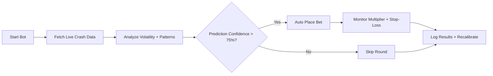

# 💹 Stake Crash Bot — Smarter Crash Predictions for Steady Profits

Stake Crash Bot is an intelligent auto-betting tool built for precision in the **Stake Crash game**. It doesn’t rely on luck — it relies on data. By reading game patterns, volatility cycles, and historical multipliers, this software helps players **automate bets**, **reduce emotional risk**, and **optimize profit potential** round after round.

---


---

## ⚙️ Overview

Stake Crash Bot is designed for **data-driven betting automation**. It connects with Stake’s web client through a secure API layer (no injection, no risk) and makes predictions using a mix of live crash data, statistical learning, and volatility indicators.

Unlike random scripts, this version features **real-time adaptive logic** — meaning it recalibrates after every crash streak or long run to predict the next safe multiplier zone.

[!IMPORTANT]
This tool does **not** alter or manipulate the game servers. It analyzes publicly visible data for **probabilistic predictions**, not guaranteed outcomes.

---

## 🧠 Key Features

### 1. Smart Crash Prediction

* Uses **weighted probability models** and time-based volatility tracking.
* Identifies “heat” or “cool” streaks to gauge safe entry zones.

### 2. Automated Betting

* Custom bet amounts and multipliers per session.
* **Auto-stop-loss** and **take-profit** systems protect balance.
* Configurable round skips after losses to avoid tilting.

### 3. Risk Management

* Live **profit/loss visualization**.
* Adjustable aggression modes: *Conservative*, *Balanced*, *Aggressive*.
* On-screen risk meter showing predicted safe multiplier range.

### 4. Cloud Config Sync

* Store and sync settings across devices.
* One-click backup & restore for all strategy files.

---

## 💻 Compatibility

| Platform              | Support                 | Notes                   |
| --------------------- | ----------------------- | ----------------------- |
| Windows 10/11         | ✅ Full                  | Auto API connect        |
| macOS (via Parallels) | ⚠️ Partial              | Manual setup required   |
| Linux                 | ✅ CLI version available | Node.js required        |
| Android/iOS           | ❌ Not supported         | Use remote desktop apps |

[!NOTE]
Runs best on **Windows 11 + Chrome**, with a stable connection above 50 Mbps.

---

## 🪄 Setup Guide

1. **Download the latest version** of Stake Crash Bot from the official repository.
2. **Unzip** and run `StakeCrashBot.exe`.
3. Enter your **Stake API key** (found in your Stake profile).
4. Adjust your strategy:

   ```json
   {
     "base_bet": 0.1,
     "target_multiplier": 2.0,
     "max_loss_streak": 3,
     "auto_withdraw": true
   }
   ```
5. Click **“Start Auto-Bet”** and watch it analyze, predict, and bet in real time.

---

## 🧩 Example Workflow



---

## ❓ FAQ

**Q: Is Stake Crash Bot safe to use?**
A: Yes — it doesn’t modify any game files or memory. It simply automates API-based analysis and decision-making.

**Q: Can it guarantee wins?**
A: No tool can. It predicts *probabilities*, not certainties — use proper bankroll control.

**Q: How often are updates released?**
A: Weekly updates adapt models to current volatility cycles.

**Q: Can I create my own strategies?**
A: Absolutely. The config system supports custom formulas and scriptable strategies (via JSON).

**Q: Does it support multiple accounts?**
A: Yes — up to 3 simultaneous Stake profiles via independent threads.

---

## 🔒 Security & Transparency

* No memory injection or browser manipulation.
* Open-source analytics core for review.
* Encrypted API communication with Stake servers.
* Optional anonymous mode hides your session ID.

---

## 🌐 Community & Support

Join our growing group of analysts and testers who refine strategies daily. Share your configs, track trends, and improve predictive accuracy together.

---

### Final Thoughts

Stake Crash Bot is **not gambling magic**, but it *is* a precision instrument for those who respect the data. It doesn’t bet for luck — it bets with logic. For disciplined players aiming to transform chaos into a measurable edge, this bot becomes more than a tool — it’s a quiet partner in profit.

Start tracking, predicting, and betting smarter — **today.**
